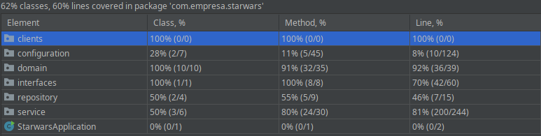

# Staw Wars API

API Rest Java com SpringBoot, mongodb, cache com redis e docker e comunicação com a api pública de Star Wars encontrada em https://swapi.dev/api/. 

### Conteúdo
- [Projeto e Arquitetura](#projeto-e-arquitetura)
  - [Desenho da Arquitetura](#desenho-da-arquitetura)
  - [Explicação da Arquitetura](#explicação-da-arquitetura)
  - [Instalação e Execução](#instalação-e-execução)
- [Tecnologias](#tecnologias)
- [Infraestrutura](#infraestrutura)
  - [Swagger](#swagger)
  - [Zipkin](#zipkin)
- [Testes](#testes)
  - [Testes Unitários](#testes-unitários)
  - [Teste de Performance](#teste-de-performance)
- [TODO](#todo)

## Projeto e Arquitetura
### Desenho da Arquitetura


### Explicação da Arquitetura

Para a criação da API, foi utilizado o padrão arquitetural REST, que pode ser definido como um conjunto de recursos, esses recursos são identificados na requisição. Um recurso pode ter diversas ações, que são métodos disponíveis pelo protocolo HTTP;

Essa API possui apenas um recurso que é o planets, podendo ser acessado a partir do caminho http://localhost:8080/planets

As ações disponíveis para esse recurso são:
- GET:
  - Todos: http://localhost:8080/planets
  - Por Id: http://localhost:8080/planets/id
  - Por Nome: http://localhost:8080/planets?name=name
 
- POST: http://localhost:8080/planets
- PUT: http://localhost:8080/planets/id
- DELETE: http://localhost:8080/planets/id

### Instalação e Execução

#### Pré Requisitos
- Docker 
- Docker Compose
- Java 
- Maven 

#### Etapas

1º Clone o repositório através do comando  `git clone `

2º Entre no diretório 

3º Execute o comando `make run` 

4º Ao final do processo o console deve ficar igual a imagem abaixo: 


#### Observações

1. Para o processo de geração de imagem, não foi utilizado um dockerfile como padrão. Para esta tarefa foi utilizado um framework Open Source chamado Jib. 
2. Caso alguma das portas utilizada nessa aplicação esteja sendo utilizada no seu computador, será necessário trocar a porta em uso por outra no arquivo docker-compose.yml


## Tecnologias
- Docker
- Java com SpringBoot
- Mongodb como banco de dados principal da aplicação
- Redis para armazenamento de cache
- Zipkin para auxiliar no rastreamento das chamadas da API
- Swagger para auxiliar a documentação da API
- Teste Unitário com Spock
- Teste de Performance com JMeter

## Infraestrutura
### Swagger
Visando seguir a especificação OpenAPI, que permite o melhor entendimento dos recursos do serviço, foi utilizado o Swagger para documentação do mesmo, podendo ser acessado pelo caminho http://localhost:8080//swagger-ui.html#/ após execução da aplicação.

### Zipkin
Com o intuito de facilitar o rastreamento das chamadas da API, incluindo o tempo de cada requisição, foi utilizado o Zipkin, podendo ser acessado pelo caminho http://localhost:9411/zipkin/ após execução da aplicação.

## Testes

### Testes Unitários
Foram escritos 100 testes unitários para a aplicação, para a escrita dos mesmos foi escolhido o framework Spock, as classes com testes escritos foram: PlanetController, PlanetCache, SwapiCache, PlanetService, SwapiService e Validation. Após a execução dos 100 testes, todos apresentaram êxito e foi possível obter uma cobertura relevante, como pode ser visto na imagem abaixo.



#### Exemplo de um código de teste


```groovy
    @Unroll
    def "GET - [/planets]"(){
        given:
        planetService.findAll() >> findAllMock

        when:
        def response = mockMvc.perform(get("/planets")
                .contentType(org.springframework.http.MediaType.APPLICATION_JSON)
        ).andReturn().response

        then:
        response.status == status.value()

        where:
        status                           | findAllMock
        HttpStatus.NOT_FOUND             | null
        HttpStatus.OK                    | new ArrayList<PlanetResponse>(Arrays.asList(Mock(PlanetResponse)))
        HttpStatus.INTERNAL_SERVER_ERROR | Exception

    }
```


### Teste de Performance
Para execução do teste de performance, foi utilizado a ferramenta JMeter com tps limitado pelas configurações do computador. Foi utilizado um grupo de 100 usuários com requisições sendo feitas durante 5 minutos. Abaixo é apresentado o relatório de vazão do teste.


## TODO
- Implementação de Paginação na API
- Impementação de Autenticação na API
- Melhorias na escrita dos testes unitários
